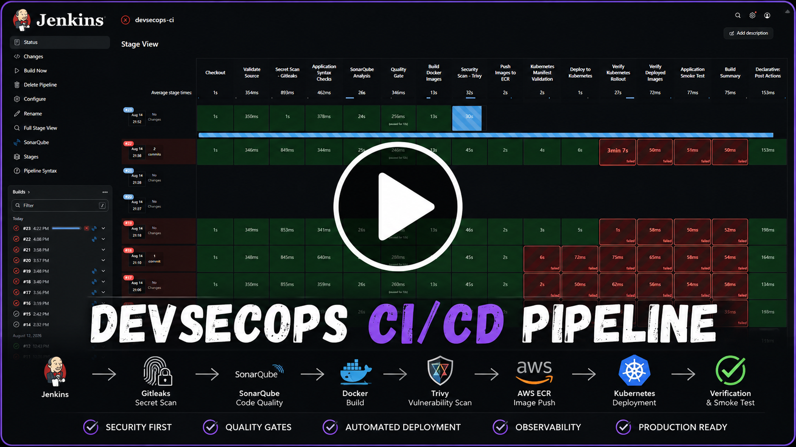
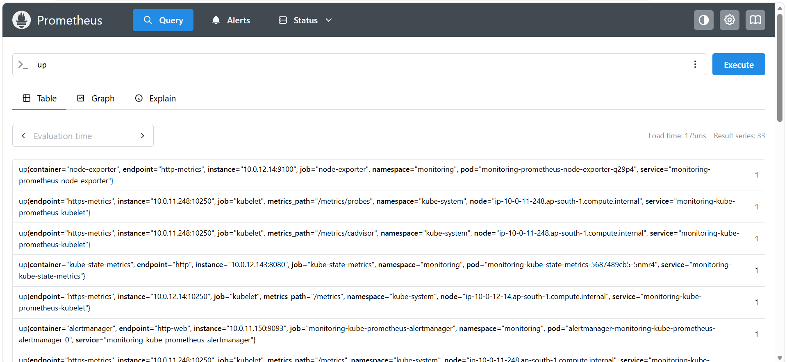

# DevSecOps Kubernetes CI/CD Pipeline

A production-oriented **end-to-end DevSecOps platform** that demonstrates secure application delivery from source code to Kubernetes deployment.

The project combines:

* Jenkins
* GitHub
* Docker
* Gitleaks
* SonarQube
* Trivy
* AWS ECR
* Kubernetes
* Kyverno
* RBAC
* NetworkPolicy
* Terraform
* Falco
* PostgreSQL
* Application security attack scenarios
* Observability

The objective is not simply to build and deploy containers, but to demonstrate how **security, code quality, infrastructure, container security, Kubernetes admission control, runtime security, and deployment verification can be integrated into a single delivery pipeline.**

---

# 🏗️ Architecture

```text
                         ┌──────────────────────┐
                         │      Developer       │
                         └──────────┬───────────┘
                                    │
                                    ▼
                         ┌──────────────────────┐
                         │       GitHub         │
                         │   Source Repository  │
                         └──────────┬───────────┘
                                    │
                                    ▼
                         ┌──────────────────────┐
                         │       Jenkins        │
                         │    DevSecOps CI/CD   │
                         └──────────┬───────────┘
                                    │
              ┌─────────────────────┼──────────────────────┐
              │                     │                      │
              ▼                     ▼                      ▼
          Gitleaks              SonarQube               Syntax
        Secret Scan            Code Quality           Validation
              │                     │                      │
              └─────────────────────┼──────────────────────┘
                                    │
                                    ▼
                         ┌──────────────────────┐
                         │     Docker Build     │
                         │                      │
                         │  Frontend            │
                         │  Auth Service        │
                         │  Data Service        │
                         └──────────┬───────────┘
                                    │
                                    ▼
                         ┌──────────────────────┐
                         │       Trivy          │
                         │ Container Security   │
                         │ HIGH / CRITICAL Gate │
                         └──────────┬───────────┘
                                    │
                              Security PASS
                                    │
                                    ▼
                         ┌──────────────────────┐
                         │       AWS ECR        │
                         │ Container Registry   │
                         └──────────┬───────────┘
                                    │
                                    ▼
                         ┌──────────────────────┐
                         │     Kubernetes       │
                         │                      │
                         │  PostgreSQL          │
                         │  Auth Service        │
                         │  Data Service        │
                         │  Frontend            │
                         └──────────┬───────────┘
                                    │
                ┌───────────────────┼───────────────────┐
                │                   │                   │
                ▼                   ▼                   ▼
             Kyverno              RBAC            NetworkPolicy
          Admission Control     Access Control       Isolation
                │
                ▼
             Falco
          Runtime Security
                │
                ▼
          Observability
```

---

## 🎥 Project Demonstration

A short demonstration of the DevSecOps pipeline from Jenkins CI through security gates, AWS ECR, Kubernetes deployment, and post-deployment verification.

[](docs/videos/devsecops-pipeline-demo-under-100mb.mp4)

**▶ Watch the full pipeline demonstration**

> Jenkins → Gitleaks → SonarQube → Docker → Trivy → AWS ECR → Kubernetes → Deployment Verification

# 🎯 Project Goals

The project is designed to demonstrate a realistic DevSecOps workflow where security is incorporated throughout the software lifecycle.

### Security starts before deployment

```text
Source Code
    │
    ▼
Secret Detection
    │
    ▼
Code Quality
    │
    ▼
Application Validation
    │
    ▼
Container Security
    │
    ▼
Registry
    │
    ▼
Kubernetes Admission Security
    │
    ▼
Runtime Security
    │
    ▼
Observability
```

This approach demonstrates the concept of **shift-left security** while also protecting the Kubernetes runtime environment.

---

# 🧩 Application Architecture

The application contains three application services and PostgreSQL.

```text
                         ┌─────────────────┐
                         │    Frontend     │
                         │   Node.js       │
                         │     :3001       │
                         └────────┬────────┘
                                  │
                                  ▼
                         ┌─────────────────┐
                         │  Auth Service   │
                         │   Node.js       │
                         │     :3000       │
                         └────────┬────────┘
                                  │
                                  ▼
                         ┌─────────────────┐
                         │  Data Service   │
                         │ Python / Flask  │
                         │     :5000       │
                         └────────┬────────┘
                                  │
                                  ▼
                         ┌─────────────────┐
                         │   PostgreSQL    │
                         │      :5432      │
                         └─────────────────┘
```

## Components

| Component          | Technology                | Purpose                       |
| ------------------ | ------------------------- | ----------------------------- |
| Frontend           | Node.js / `serve`         | Web interface                 |
| Auth Service       | Node.js                   | Authentication                |
| Data Service       | Python / Flask / Gunicorn | Data API                      |
| Database           | PostgreSQL 16             | Persistent storage            |
| CI/CD              | Jenkins                   | Automation                    |
| SCM                | GitHub                    | Source control                |
| Secret Security    | Gitleaks                  | Secret detection              |
| Code Quality       | SonarQube                 | Static analysis               |
| Container Security | Trivy                     | Vulnerability scanning        |
| Registry           | AWS ECR                   | Container image storage       |
| Orchestration      | Kubernetes                | Application deployment        |
| Admission Security | Kyverno                   | Kubernetes policy enforcement |
| Runtime Security   | Falco                     | Runtime threat detection      |
| Infrastructure     | Terraform                 | Infrastructure provisioning   |

---

# 🔄 Complete CI/CD Pipeline

The Jenkins pipeline is structured into **15 stages**.

The current Jenkinsfile defines the complete flow from source checkout through deployment and post-deployment validation.

```text
1. Checkout
       ↓
2. Validate Source
       ↓
3. Gitleaks Secret Scan
       ↓
4. Application Syntax Checks
       ↓
5. SonarQube Analysis
       ↓
6. SonarQube Quality Gate
       ↓
7. Build Docker Images
       ↓
8. Trivy Security Scan
       ↓
9. Push Images to AWS ECR
       ↓
10. Kubernetes Manifest Validation
       ↓
11. Deploy to Kubernetes
       ↓
12. Verify Kubernetes Rollout
       ↓
13. Verify Deployed Images
       ↓
14. Application Smoke Test
       ↓
15. Final Summary
```

---

# 1️⃣ Checkout

Jenkins checks out the source repository and records the current Git revision.

The pipeline also uses:

```groovy
skipDefaultCheckout(true)
```

so that checkout is explicitly controlled inside the pipeline.

Additional Jenkins controls include:

* Timestamps
* Concurrent-build prevention
* Build history retention
* Pipeline timeout

---

# 2️⃣ Source Validation

The pipeline validates that critical application and deployment files exist.

Examples:

```text
app/auth-service/package.json
app/auth-service/index.js

app/data-service/app.py
app/data-service/requirements.txt

app/frontend/package.json
app/frontend/package-lock.json

Dockerfiles

kubernetes/
```

This prevents the pipeline from progressing if the expected project structure is missing.

---

# 3️⃣ Gitleaks Secret Scanning

Gitleaks runs as an ephemeral container:

```text
ghcr.io/gitleaks/gitleaks:v8.30.0
```

The Jenkins workspace is mounted read-only into the scanner.

```text
Jenkins Workspace
       │
       ▼
   Gitleaks
       │
       ├── Secret found → FAIL
       │
       └── Clean → Continue
```

The pipeline therefore treats accidental credential exposure as a CI failure.

---

# 4️⃣ Application Validation

The pipeline performs basic syntax validation before building containers.

### Node.js

```bash
node --check app/auth-service/index.js
```

### Python

```bash
python3 -m py_compile app/data-service/app.py
```

This catches basic application syntax errors before containerization.

---

# 5️⃣ SonarQube Analysis

SonarQube performs static code analysis.

Configured project:

```text
devsecops-kubernetes-ci-cd
```

The analysis covers:

```text
app/
```

while excluding generated and dependency directories such as:

```text
node_modules
package-lock.json
__pycache__
```

---

# 6️⃣ Quality Gate

The pipeline waits for the SonarQube quality gate.

```text
SonarQube Analysis
       │
       ▼
   Quality Gate
       │
   ┌───┴────┐
   │        │
 FAIL      PASS
   │        │
 STOP   Continue
```

The pipeline uses:

```groovy
waitForQualityGate abortPipeline: true
```

so a failed quality gate blocks the rest of the pipeline.

---

# 7️⃣ Docker Image Build

Three Docker images are built:

```text
devsecops/auth-service:${BUILD_NUMBER}
devsecops/data-service:${BUILD_NUMBER}
devsecops/frontend:${BUILD_NUMBER}
```

Docker builds use:

```bash
docker build --pull
```

which ensures the build checks for updated base images.

---

# 🔐 Container Hardening

The application containers were hardened before being integrated into the security pipeline.

## Auth Service

Security improvements include:

* Minimal Alpine runtime
* Multi-stage build
* Non-root execution
* Dependency separation
* Runtime package-manager reduction

## Data Service

The Python service uses:

```text
python:3.12-alpine
```

with a dedicated virtual environment.

Runtime execution uses:

```text
UID 10001
```

rather than root.

## Frontend

The frontend uses:

```text
node:20-alpine
```

and:

```bash
npm ci --omit=dev
```

A committed `package-lock.json` provides deterministic dependency installation.

The final runtime removes:

```text
npm
npx
```

and executes:

```text
./node_modules/.bin/serve
```

directly.

The frontend container was also verified to run as the non-root `node` user.

---

# 8️⃣ Trivy Container Security

After Docker images are built, Trivy scans each image.

```text
Docker Build
     │
     ▼
   Trivy
     │
     ├── HIGH/CRITICAL → Pipeline FAIL
     │
     └── Clean → Continue
```

Configured scanner:

```text
aquasec/trivy:0.72.0
```

The pipeline scans:

```text
auth-service
data-service
frontend
```

using:

```text
--severity HIGH,CRITICAL
--exit-code 1
```

Therefore Trivy is a **blocking security gate**, not merely an informational report.

---

# 9️⃣ AWS ECR

Images that successfully pass Trivy are authenticated and pushed to AWS ECR.

Configured region:

```text
ap-south-1
```

Pipeline flow:

```text
Docker Image
     │
     ▼
Trivy
     │
     ▼
AWS Authentication
     │
     ▼
ECR Login
     │
     ▼
Docker Tag
     │
     ▼
Docker Push
```

Images are tagged using the Jenkins build number:

```text
auth-service:${BUILD_NUMBER}
data-service:${BUILD_NUMBER}
frontend:${BUILD_NUMBER}
```

This provides traceability between:

```text
Git Commit
    ↓
Jenkins Build
    ↓
Docker Image
    ↓
ECR Image
    ↓
Kubernetes Deployment
```

The ECR publishing stage is explicitly defined in the Jenkins pipeline.

---

# ☸️ 10️⃣ Kubernetes Manifest Validation

Before deployment, Kubernetes manifests are validated using:

```bash
kubectl apply --dry-run=server
```

The manifests cover:

```text
PostgreSQL
Auth Service
Data Service
Frontend
```

The pipeline also verifies:

```bash
kubectl get nodes
kubectl config current-context
```

This provides an early validation step before modifying the running workloads.

---

# 🚀 11️⃣ Kubernetes Deployment

The pipeline applies the application manifests:

```text
postgres
auth-service
data-service
frontend
```

After applying the manifests, Jenkins updates the running deployments to the exact ECR image associated with the current Jenkins build.

```text
Jenkins Build #N
       │
       ▼
ECR Image :N
       │
       ▼
kubectl set image
       │
       ▼
Kubernetes Deployment
```

This ensures that the deployment corresponds to the specific CI build.

---

# 🛡️ Kubernetes Security

The repository contains Kubernetes security controls including:

```text
RBAC
NetworkPolicy
Kyverno
Service Accounts
```

Repository structure includes:

```text
kubernetes/
├── attacker-pod.yaml
├── auth-service-deployment.yaml
├── auth-service.yaml
├── data-service-deployment.yaml
├── data-service.yaml
├── frontend-deployment.yaml
├── frontend.yaml
├── network-deny-all.yaml
├── network-allow-auth.yaml
├── postgres-deployment.yaml
├── postgres.yaml
├── rbac-secure.yaml
├── rbac-vulnerable.yaml
├── service-account.yaml
└── kyverno/
```

This allows the project to demonstrate both insecure and hardened Kubernetes configurations.

---

# 🔒 Kyverno Admission Control

Kyverno is used as a Kubernetes admission policy engine.

Conceptually:

```text
kubectl apply
      │
      ▼
 Kubernetes API Server
      │
      ▼
    Kyverno
      │
 ┌────┴─────┐
 │          │
 DENY      ALLOW
 │          │
STOP      Deploy
```

The Jenkins pipeline explicitly validates manifests before deployment and expects Kyverno admission policies to be enforced during the actual deployment.

---

# 🔐 RBAC

The project includes both:

```text
rbac-secure.yaml
rbac-vulnerable.yaml
```

This enables a practical comparison between excessive permissions and least-privilege access.

The project therefore demonstrates:

* Service Accounts
* Roles
* RoleBindings
* Least privilege
* Kubernetes API permissions

---

# 🌐 NetworkPolicy

The project includes:

```text
network-deny-all.yaml
network-allow-auth.yaml
```

The intended security model is:

```text
Default
  │
  ▼
DENY ALL
  │
  ├── Allowed communication
  │       │
  │       ▼
  │   Auth → Data
  │
  └── Everything else → DENY
```

This demonstrates Kubernetes network segmentation rather than relying only on application-level security.

---

# 🧨 Attack Scenarios

The repository contains an:

```text
attack-scenarios/
```

directory.

The project is designed to demonstrate security controls against realistic attack patterns rather than simply showing security tools in isolation.

The security workflow becomes:

```text
Attack
  ↓
Detection
  ↓
Policy / Security Control
  ↓
Blocked or Detected
  ↓
Evidence
```

This makes the project more suitable for security-focused DevOps and DevSecOps interviews.

---

# 🛡️ Falco Runtime Security

The repository also contains:

```text
falco/
```

Falco is intended to extend security from the CI/CD pipeline into the Kubernetes runtime.

The overall model becomes:

```text
CI Security
     │
     ├── Gitleaks
     ├── SonarQube
     └── Trivy
     
Kubernetes Security
     │
     ├── Kyverno
     ├── RBAC
     └── NetworkPolicy

Runtime Security
     │
     └── Falco
```

This demonstrates the distinction between:

**preventing insecure artifacts from being deployed** and **detecting suspicious behavior after deployment.**

---

# 📊 Observability

The repository contains:

```text
observability/
```

The observability layer is intended to provide visibility into the deployed platform.

The target architecture is:

```text
Applications
     │
     ├──────── Metrics ───────► Prometheus
     │                              │
     │                              ▼
     │                           Grafana
     │
     ├──────── Logs ──────────► Loki
     │                              │
     │                              ▼
     │                           Grafana
     │
     └──────── Traces ─────────► OpenTelemetry
```

Observability complements the security pipeline by allowing operators to investigate application and infrastructure behavior after deployment.

---

# 🏗️ Terraform

Infrastructure provisioning is represented under:

```text
terraform/
```

Current Terraform-related files include:

```text
terraform/
├── main.tf
├── providers.tf
├── variables.tf
├── outputs.tf
├── terraform.tfvars
├── terraform.tfstate
├── terraform.tfstate.backup
├── devsecops-eks.tfplan
└── devsecops-vpc.tfplan
```

Terraform is intended to provide infrastructure-as-code for the AWS environment.

The high-level infrastructure flow is:

```text
Terraform
    │
    ▼
AWS VPC
    │
    ▼
EKS
    │
    ▼
Kubernetes Platform
```

---

# 🗂️ Repository Structure

```text
DevSecOps-Kubernetes-CI-CD-Pipeline/
│
├── Jenkinsfile
├── README.md
├── docker-compose.yml
│
├── app/
│   ├── auth-service/
│   ├── data-service/
│   └── frontend/
│
├── attack-scenarios/
│
├── kubernetes/
│   ├── attacker-pod.yaml
│   ├── auth-service.yaml
│   ├── auth-service-deployment.yaml
│   ├── data-service.yaml
│   ├── data-service-deployment.yaml
│   ├── frontend.yaml
│   ├── frontend-deployment.yaml
│   ├── postgres.yaml
│   ├── postgres-deployment.yaml
│   ├── network-deny-all.yaml
│   ├── network-allow-auth.yaml
│   ├── rbac-secure.yaml
│   ├── rbac-vulnerable.yaml
│   ├── service-account.yaml
│   └── kyverno/
│
├── terraform/
│
├── falco/
│
├── observability/
│
└── docs/
```

The repository currently contains these major platform areas, including application code, Kubernetes manifests, attack scenarios, observability, Falco, and Terraform.

---

# 🔁 Deployment Verification

The pipeline does not stop after `kubectl apply`.

It verifies the deployment in multiple stages.

## Rollout Verification

Jenkins waits for:

```text
auth-service
data-service
frontend
```

using:

```bash
kubectl rollout status
```

with a timeout.

It then displays deployments and pods.

---

# 🏷️ Deployed Image Verification

Jenkins retrieves the actual image configured on each deployment:

```text
auth-service
data-service
frontend
```

and compares it conceptually against the current Jenkins build.

This prevents a successful `kubectl apply` from being treated as proof that the expected image is actually running.

---

# 🧪 Application Smoke Test

The final application validation checks:

```text
Services
Pods
Running workloads
```

This gives the pipeline a basic post-deployment health validation instead of considering Kubernetes object creation alone as success.

---

# 📋 Final Pipeline Summary

The Jenkins pipeline produces a final DevSecOps summary covering:

```text
SOURCE SECURITY
    Gitleaks

CODE QUALITY
    Syntax Validation
    SonarQube
    Quality Gate

CONTAINER SECURITY
    Docker Build
    Trivy

REGISTRY
    AWS ECR

KUBERNETES
    Manifest Validation
    Kyverno
    Deployment
    Rollout Verification
    Image Verification

APPLICATION
    Smoke Validation
```

---

# 🔐 Security Model

The project's security architecture can be summarized as:

```text
                 DEVSECOPS SECURITY
                        │
        ┌───────────────┼────────────────┐
        │               │                │
        ▼               ▼                ▼
     SOURCE          BUILD            RUNTIME
        │               │                │
    Gitleaks        Docker             Falco
        │               │
    SonarQube        Trivy
        │               │
        ▼               ▼
     Quality          ECR
       Gate             │
                        ▼
                   Kubernetes
                        │
              ┌─────────┼─────────┐
              ▼         ▼         ▼
           Kyverno     RBAC   NetworkPolicy
```

---

# 🎯 Why This Project Is Different

This is intentionally more than a basic:

```text
GitHub → Jenkins → Docker → Kubernetes
```

pipeline.

It demonstrates security at multiple layers:

### 1. Source security

```text
Gitleaks
```

### 2. Code quality

```text
SonarQube
Quality Gate
```

### 3. Container security

```text
Trivy
Non-root containers
Multi-stage builds
Minimal images
```

### 4. Supply-chain security

```text
Build
  ↓
Scan
  ↓
ECR
```

### 5. Kubernetes security

```text
Kyverno
RBAC
NetworkPolicy
```

### 6. Runtime security

```text
Falco
```

### 7. Observability

### Prometheus Metrics Collection

Prometheus is actively scraping metrics from the Kubernetes platform and supporting monitoring components.

The `up` query confirms that multiple monitoring targets are healthy, including:

- Kubernetes kubelet
- cAdvisor
- Node Exporter
- kube-state-metrics
- Alertmanager

A value of `1` indicates that Prometheus successfully reached and scraped the target.



*Prometheus successfully scraping Kubernetes and platform monitoring targets.*

```text
Prometheus
Grafana
Loki
OpenTelemetry
```
### Kubernetes Workload Metrics

Prometheus can also query Kubernetes workload state through `kube-state-metrics`.

For example, the following PromQL query:

```promql
count(kube_pod_info)

### 8. Infrastructure security

```text
Terraform
```

---

# 📈 Engineering Principles

## Security Gates

Security tools are integrated as pipeline gates rather than passive reports.

## Least Privilege

Containers and Kubernetes workloads are designed around non-root execution and controlled permissions.

## Immutable Artifacts

Images are tagged with Jenkins build numbers:

```text
auth-service:BUILD_NUMBER
data-service:BUILD_NUMBER
frontend:BUILD_NUMBER
```

This provides deployment traceability.

## Defense in Depth

Multiple independent security controls are used:

```text
Gitleaks
+
SonarQube
+
Trivy
+
Kyverno
+
RBAC
+
NetworkPolicy
+
Falco
```

## Verification After Deployment

Deployment success requires more than `kubectl apply`.

The pipeline validates:

```text
Manifest
   ↓
Deployment
   ↓
Rollout
   ↓
Image
   ↓
Pods
   ↓
Application
```

---

# 🚦 Project Status

## Implemented / Integrated

* [x] Application containerization
* [x] PostgreSQL integration
* [x] Auth service hardening
* [x] Data service hardening
* [x] Frontend hardening
* [x] Non-root containers
* [x] Multi-stage builds
* [x] Frontend dependency lockfile
* [x] Jenkins pipeline
* [x] Gitleaks
* [x] SonarQube integration
* [x] SonarQube Quality Gate
* [x] Trivy security gate
* [x] AWS ECR pipeline integration
* [x] Kubernetes manifests
* [x] Kubernetes manifest validation
* [x] Kubernetes deployment automation
* [x] Rollout verification
* [x] Deployed-image verification
* [x] Application smoke validation
* [x] Kyverno policies
* [x] RBAC configurations
* [x] NetworkPolicy configurations
* [x] Attack scenarios
* [x] Terraform infrastructure
* [x] Falco integration area
* [x] Observability integration area

> Some components in the repository are configured/implemented but should only be marked **production-verified** after their corresponding Jenkins run or runtime demonstration has been successfully executed.

---

# 🗺️ Future Evolution

The project can evolve toward:

```text
                    GitHub
                       │
                       ▼
                    Jenkins
                       │
        ┌──────────────┼──────────────┐
        ▼              ▼              ▼
    Gitleaks       SonarQube       Tests
        │              │              │
        └──────────────┼──────────────┘
                       ▼
                 Docker Build
                       │
                       ▼
                    Trivy
                       │
                       ▼
                     ECR
                       │
                       ▼
                 Kubernetes
                       │
             ┌─────────┴─────────┐
             ▼                   ▼
          Kyverno             NetworkPolicy
             │
             ▼
           Deploy
             │
             ▼
          Rollout
             │
             ▼
           Falco
             │
             ▼
       Observability
```

---

# 💬 Interview Explanation

A concise explanation of the project:

> **"I built an end-to-end DevSecOps pipeline for a multi-service application using Jenkins, Docker, Gitleaks, SonarQube, Trivy, AWS ECR, and Kubernetes. The pipeline performs secret scanning, static code analysis, quality-gate validation, secure container builds, vulnerability scanning, registry publishing, Kubernetes manifest validation, deployment, rollout verification, deployed-image verification, and application smoke testing. On the Kubernetes side, I added Kyverno, RBAC, NetworkPolicies, attack scenarios, and Falco to demonstrate security beyond the CI pipeline. Terraform is used for infrastructure provisioning, while observability components provide visibility into the deployed platform."**

---

# ⭐ Core Architecture

```text
                         ┌─────────────────┐
                         │     GitHub      │
                         └────────┬────────┘
                                  │
                                  ▼
                         ┌─────────────────┐
                         │     Jenkins     │
                         └────────┬────────┘
                                  │
             ┌────────────────────┼────────────────────┐
             │                    │                    │
             ▼                    ▼                    ▼
          Gitleaks            SonarQube             Tests
             │                    │                    │
             └────────────────────┼────────────────────┘
                                  │
                                  ▼
                            Docker Build
                                  │
                                  ▼
                                Trivy
                                  │
                             SECURITY GATE
                                  │
                                  ▼
                                AWS ECR
                                  │
                                  ▼
                            Kubernetes
                                  │
             ┌────────────────────┼────────────────────┐
             │                    │                    │
             ▼                    ▼                    ▼
          Kyverno                RBAC            NetworkPolicy
             │
             ▼
        Application
             │
       ┌─────┼─────┐
       ▼     ▼     ▼
   Frontend Auth  Data
                    │
                    ▼
                PostgreSQL
                    │
             ┌──────┴──────┐
             ▼             ▼
           Falco       Observability
                         │
                 ┌───────┼────────┐
                 ▼       ▼        ▼
              Metrics   Logs    Traces
```

---

# 🏁 Final Objective

The ultimate goal of this project is to demonstrate a realistic **secure software delivery platform**, where:

```text
Code
 ↓
Security
 ↓
Quality
 ↓
Build
 ↓
Scan
 ↓
Registry
 ↓
Policy
 ↓
Deploy
 ↓
Verify
 ↓
Monitor
 ↓
Detect
```

rather than treating DevOps, security, Kubernetes, and observability as separate tools.

